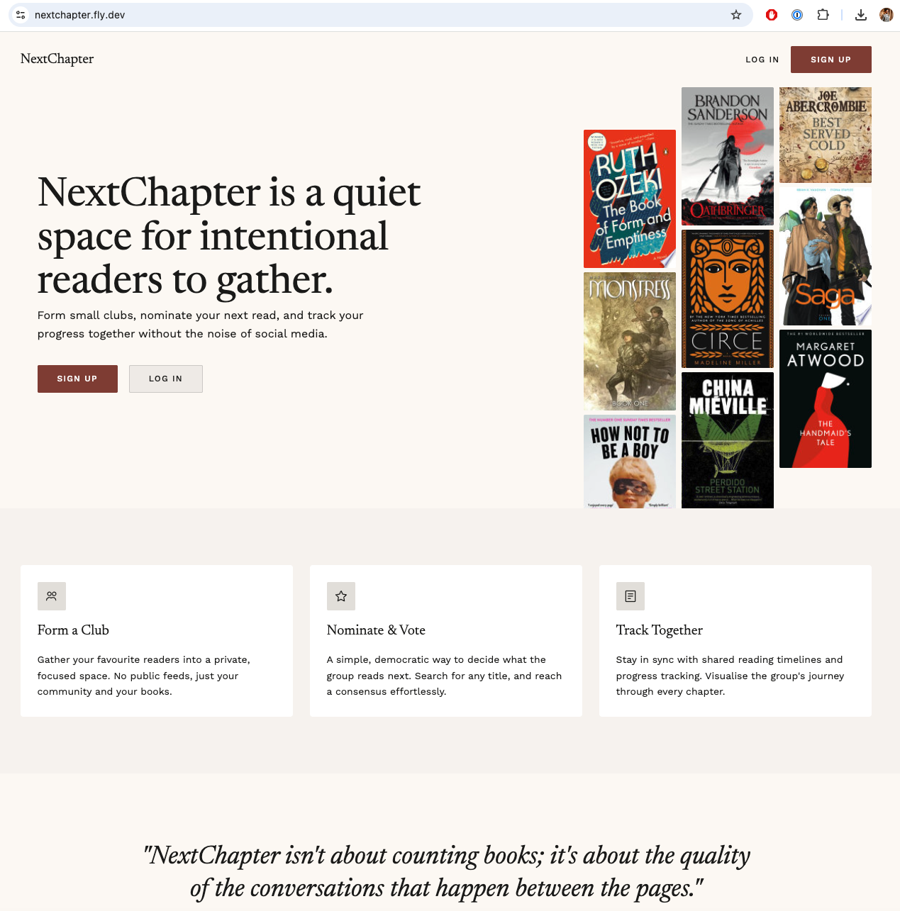

# NextChapter

A book club web app. Groups of readers form a club, nominate books, vote on
what to read next, and track what they've read together.

Built as a portfolio project across nine focused days to demonstrate tightly
scoped, modern Rails 8 development: Hotwire for a server-rendered UI,
Solid Queue for background jobs, Active Storage for file handling, and an
Expo / React Native companion app for mobile (in progress).

**Status:** Day 6 of 9—full club lifecycle shipped, design system applied, public landing page with featured book collage, user avatars, and Tailwind v4 visual polish.

Active development. See [JOURNAL](docs/JOURNAL.md) for daily progress.

[](https://github.com/stevebutler2210/nextchapter/actions/workflows/ci.yml)


---

## Live demo

[nextchapter.fly.dev](https://nextchapter.fly.dev)



---

## Project docs

These are worth reading before the code—they show the thinking behind the
project as much as the implementation.

| Doc                             | Purpose                                                                                                          |
| ------------------------------- | ---------------------------------------------------------------------------------------------------------------- |
| [PLAN.md](docs/PLAN.md)         | Day-0 plan. Committed at the start and not rewritten—the gap between plan and shipped is part of the story.      |
| [JOURNAL.md](docs/JOURNAL.md)   | Daily log. What shipped, what changed, what was surprising.                                                      |
| [WORKFLOW.md](docs/WORKFLOW.md) | Conventions, branching, commit style, ticket format, deployment.                                                 |
| [decisions/](docs/decisions/)   | Architecture Decision Records. One file per meaningful choice, covering context, alternatives, and consequences. |

---

## Stack

**Web (`nextchapter`)**

- Ruby 3.4.9, Rails 8.1.3
- SQLite (development and production via Fly.io persistent volume)
- Hotwire (Turbo + Stimulus)—server-rendered UI, no client-side SPA
- Tailwind CSS v4 with a custom `nc-` design system
- Solid Queue for background jobs
- Solid Cache for caching
- Solid Cable for Action Cable
- Active Storage for book cover images
- Active Record Encryption for reading log notes
- Faraday for Google Books API integration
- Minitest, GitHub Actions CI
- Deployed to Fly.io

**Mobile (`nextchapter-mobile`)** _(in progress, Day 8–9)_

- Expo SDK, React Native, TypeScript
- Expo Router for navigation
- JWT auth against the Rails API
- ISBN barcode scanning to add books

---

## Local setup

### Prerequisites

- Ruby 3.4.9 (`rbenv` or `asdf` recommended)
- Bundler
- A Google Books API key ([get one here](https://console.cloud.google.com/apis/library/books.googleapis.com))

### Steps

```bash
git clone https://github.com/stevebutler2210/nextchapter.git
cd nextchapter
bin/setup
```

> **Note:** `db:reset` does not load `cable_schema.rb` automatically. After a reset, if live features (vote tallies, nomination broadcasts) aren't working, load it manually: `bin/rails runner 'load Rails.root.join("db/cable_schema.rb")'`

Add your Google Books API key to Rails credentials:

```bash
bin/rails credentials:edit
```

Add the following:

```yaml
google_books_api_key: YOUR_KEY_HERE
```

Start the app (web + background worker):

```bash
bin/dev
```

Visit [http://localhost:3000](http://localhost:3000).

---

## Running tests

```bash
bin/rails test
```

CI runs on every pull request via GitHub Actions (docs-only PRs are ignored).

---

## On AI assistance

This project was built with AI assistance—Claude for planning, scoping, and
decision rubber-ducking; Copilot for day-to-day code suggestions. The thinking
was collaborative; the judgment calls are mine.

Every decision in [docs/decisions/](docs/decisions/) is one I understood,
agreed with after weighing alternatives, and can speak to under questioning.
